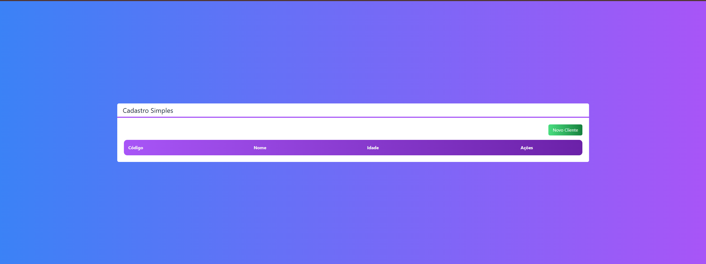
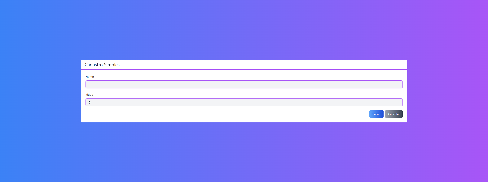

<h1 align="center">Next-Crud</h1>

<p align="center">Cadastro simples. com funcionalidades de criar e deletar</p>

# TECNOLOGIAS 
<ul>
  <li>react</li>
  <li>firebase</li>
  <li>next</li>
  <li>postcss</li>
  <li>tailwindcss</li>
  <li>typescript</li>
</ul>


#CONFIGURAÇÃO DO PROJETO
```
# Abra o terminal e clone o repositório com o comando
git clone https://github.com/rodrigopfialho/next-crud

No terminal digite os seguintes comando.

npm i

npm run dev
```
<span>O projeto estará disponivel no  http://localhost:3000</span>

<p align="center"> 
    
    
</p>
